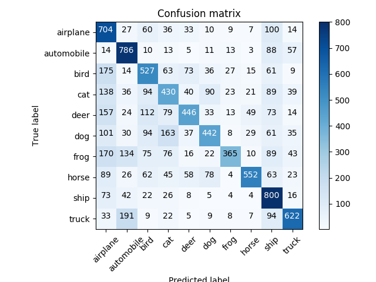
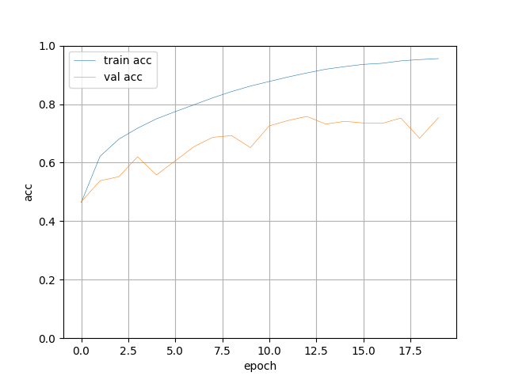
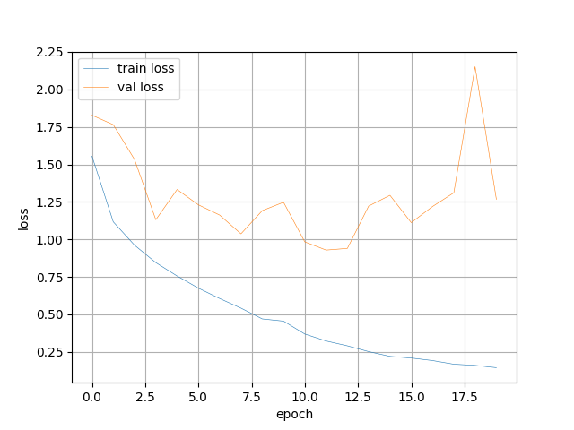
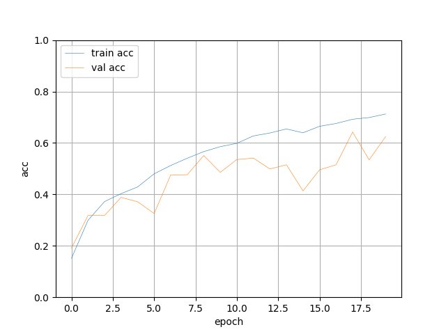
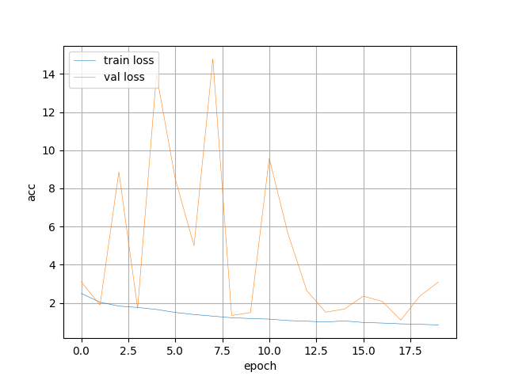

# ResNet-TensorFlow2
ResNet TensorFlow2

ResNet 网络结构：

Downsampling is performed by conv3 1, conv4 1, and conv5 1 with a stride of 2.

使用ResNet训练分类数据集cifar

*train resnet18*

*train resnet50*

*reference*

https://github.com/calmisential/TensorFlow2.0_ResNet